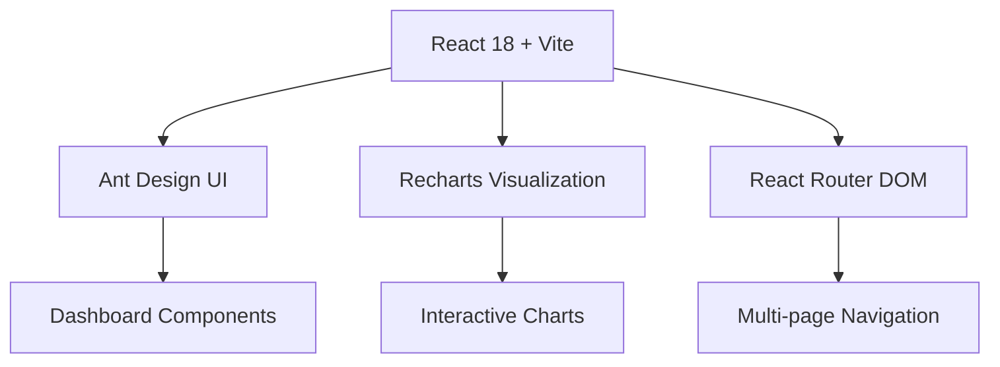

<div align="center">

# 🏥 Hospital Schedule of Charges (SOC) Management – Payer-Side Dashboard


<br/>

<!-- Animated Healthcare Icons -->
<p>
  
  &nbsp;&nbsp;&nbsp;
  
  &nbsp;&nbsp;&nbsp;
  
  &nbsp;&nbsp;&nbsp;
  
</p>

[](https://reactjs.org/)
[](https://fastapi.tiangolo.com/)
[](https://ant.design/)
[](https://python.org/)
[](https://nodejs.org/)

<br/>

<!-- Wave Animation -->


### 💫 *A comprehensive healthcare analytics platform for payer organizations to manage and analyze hospital Schedule of Charges data*

<!-- GitHub Stats Animation -->


<!-- Contribution Snake Animation -->
<picture>
  <source media="(prefers-color-scheme: dark)" srcset="https://raw.githubusercontent.com/Vaishu-Develops/Vaishu-Develops/output/github-contribution-grid-snake-dark.svg">
  <source media="(prefers-color-scheme: light)" srcset="https://raw.githubusercontent.com/Vaishu-Develops/Vaishu-Develops/output/github-contribution-grid-snake.svg">
  
</picture>

</div>

---

## 🌟 Project Overview

The **Hospital Schedule of Charges (SOC) Management – Payer-Side Dashboard** is an advanced analytics platform designed to empower payer organizations with comprehensive insights into healthcare provider networks. This full-stack application combines powerful data visualization capabilities with robust backend processing to deliver actionable intelligence for healthcare financial management.

## 🎬 Demo Video

<div align="center">

https://github.com/user-attachments/assets/demo-video.mp4

*Watch the complete walkthrough of the Hospital SOC Management Dashboard*

**Alternatively, view the demo video here:** [Demo Video](./frontend/frontend-main/public/Vite%20+%20React%20-%20Google%20Chrome%202026-01-07%2020-19-13.mp4)

</div>

### 🎯 Key Objectives

- **Provider Network Analysis**: Comprehensive evaluation of hospital networks and their capabilities
- **Cost Management**: Advanced analytics for Schedule of Charges optimization
- **Quality Assessment**: Multi-dimensional hospital performance evaluation
- **Risk Management**: Proactive identification and mitigation of network risks
- **Compliance Monitoring**: Real-time tracking of certification and regulatory compliance

---

## 🏗️ Architecture & Technology Stack

<div align="center">

### Frontend Architecture


</div>

### 🔧 Technology Stack

| Layer | Technology | Version | Purpose |
|-------|------------|---------|---------|
| **Frontend** | React | 18.3.1 | UI Framework |
| | Vite | Latest | Build Tool & Dev Server |
| | Ant Design | 5.27.0 | Component Library |
| | Recharts | 3.1.2 | Data Visualization |
| | React Router | 7.8.0 | Routing & Navigation |
| | Axios | 1.11.0 | HTTP Client |
| **Backend** | FastAPI | 0.104.1 | Web Framework |
| | Uvicorn | 0.24.0 | ASGI Server |
| | Python | 3.13 | Runtime |
| **Styling** | CSS3 | - | Custom Styling |
| | Ant Design | 5.27.0 | Component Styling |
| **Development** | ESLint | Latest | Code Linting |
| | Git | Latest | Version Control |

---

## 📊 Features & Analytics Modules

### 🔍 **Core Analytics Dashboards**

<details>
<summary><strong>🏥 Hospital Network Analysis</strong></summary>

- **Hospital List Management** (Q01) - Comprehensive provider directory
- **Hospital Type Distribution** (Q01) - Network composition analysis  
- **State-wise Hospital Distribution** (Q06) - Geographic coverage mapping
- **Hospital Location Analysis** (Q15) - Geospatial intelligence
- **Hospital Tier Classification** (Q25) - Provider segmentation

</details>

<details>
<summary><strong>🎯 Quality & Certification Management</strong></summary>

- **NABH Certified Hospitals** (Q02) - Accreditation tracking
- **Certification Timeline** (Q13) - Compliance monitoring
- **Certification Matrix** (Q22) - Multi-dimensional certification view
- **Certification Coverage Analysis** (Q23) - Network certification gaps
- **Document Verification** (Q08) - Compliance documentation

</details>

<details>
<summary><strong>⚕️ Clinical Capabilities Assessment</strong></summary>

- **Doctor Specialty Distribution** (Q07) - Provider expertise mapping
- **Specialty Coverage Matrix** (Q21) - Service line analysis
- **Hospital Capability Assessment** (Q09) - Comprehensive capability scoring
- **Equipment Availability** (Q04) - Medical equipment inventory
- **Equipment Modernization** (Q19) - Technology advancement tracking

</details>

<details>
<summary><strong>🏨 Infrastructure & Capacity Management</strong></summary>

- **Hospital Infrastructure Scoring** (Q05) - Facility assessment
- **Bed Capacity Dashboard** (Q18) - Capacity management
- **Ward Occupancy Analysis** (Q12) - Utilization metrics
- **Nurse-Bed Ratio Dashboard** (Q17) - Staffing adequacy
- **Hospital Staffing Analysis** (Q11) - Human resource optimization

</details>

<details>
<summary><strong>📈 Performance & Risk Analytics</strong></summary>

- **Hospital Performance Dashboard** (Q14) - KPI monitoring
- **Hospital Risk Assessment** (Q16) - Risk profiling
- **Staffing Adequacy Analysis** (Q26) - Resource optimization
- **Contact Availability** (Q24) - Communication reliability
- **Emergency Contact Availability** (Q03) - Emergency preparedness

</details>

---

## 📸 Screenshots & Visual Gallery

> **📷 Screenshot Placeholder Section**
> 
> *Add your project screenshots here to showcase the dashboard interfaces*

<div align="center">

### 🖥️ Main Dashboard
<!-- Add main dashboard screenshot here -->
*[Main Dashboard Screenshot Placeholder]*

### 📊 Analytics Views
<!-- Add analytics screenshots here -->
*[Analytics Dashboard Screenshots Placeholder]*

### 🗺️ Geographic Analysis
<!-- Add map view screenshot here -->
*[Geographic Analysis Screenshot Placeholder]*

### 📱 Responsive Design
<!-- Add mobile view screenshots here -->
*[Mobile Responsive Screenshots Placeholder]*

</div>

---

## 🚀 Getting Started

### 📋 Prerequisites

Before running the project, ensure you have the following installed:

- **Node.js** (LTS version recommended)
- **Python** 3.13 or higher
- **Git** for version control
- **Modern web browser** (Chrome, Firefox, Safari, Edge)

### 🔧 Installation & Setup

#### 1️⃣ **Clone the Repository**
```bash
git clone https://github.com/Vaishu-Develops/Payer_Side.git
cd Payer_Side_Intern
```

#### 2️⃣ **Backend Setup**
```bash
# Navigate to backend directory
cd backend

# Install Python dependencies
pip install -r requirements.txt

# Start the FastAPI server
uvicorn main:app --reload --host 127.0.0.1 --port 8000
```

#### 3️⃣ **Frontend Setup**
```bash
# Navigate to frontend directory
cd frontend/frontend-main

# Install Node.js dependencies
npm install

# Start the development server
npm run dev
```

#### 4️⃣ **Access the Application**
- **Frontend Dashboard**: http://localhost:5173
- **Backend API Documentation**: http://localhost:8000/docs
- **API Redoc**: http://localhost:8000/redoc

---

## 📁 Project Structure

```
Payer_Side_Intern/
├── 📁 backend/                     # FastAPI Backend
│   ├── 📄 main.py                  # Main API application
│   ├── 📄 requirements.txt         # Python dependencies
│   └── 📁 data/                    # JSON data files
│       ├── hospitals.json
│       ├── doctors.json
│       ├── medical_specialties.json
│       └── ... (other data files)
│
├── 📁 frontend/                    # React Frontend
│   └── 📁 frontend-main/
│       ├── 📄 package.json         # Node.js dependencies
│       ├── 📄 vite.config.js       # Vite configuration
│       └── 📁 src/
│           ├── 📄 App.jsx          # Main App component
│           ├── 📁 pages/           # Page components
│           │   └── 📁 Vaishnavi/
│           │       └── 📁 files/   # Dashboard components
│           │           ├── Q01_HospitalList.jsx
│           │           ├── Q06_StateWiseHospitalCount.jsx
│           │           ├── Q17_NurseBedRatioDashboard.jsx
│           │           └── ... (26 total components)
│           ├── 📁 services/        # API services
│           └── 📁 utils/           # Utility functions
│
└── 📄 README.md                    # This file
```

---

## 🔗 API Endpoints

The FastAPI backend provides comprehensive RESTful APIs for healthcare data management:

### 🏥 **Hospital Management**
- `GET /hospitals` - Retrieve all hospitals
- `GET /hospitals/{id}` - Get specific hospital details
- `GET /hospitals/search` - Search hospitals by criteria

### 📊 **Analytics Endpoints**
- `GET /analytics/hospital-distribution` - Geographic distribution
- `GET /analytics/certification-status` - Certification analytics
- `GET /analytics/capacity-metrics` - Capacity analysis

### 🎯 **Specialty Services**
- `GET /specialties` - Medical specialties catalog
- `GET /doctors` - Healthcare provider directory
- `GET /equipment` - Medical equipment inventory

### 📈 **Performance Metrics**
- `GET /metrics/performance` - Hospital performance data
- `GET /metrics/quality` - Quality indicators
- `GET /metrics/risk-assessment` - Risk profiling data

---

## 🎨 Design Philosophy

### 🎯 **User Experience**
- **Intuitive Navigation**: Clean, professional interface with logical information hierarchy
- **Data Visualization**: Interactive charts and graphs for complex healthcare data
- **Responsive Design**: Seamless experience across desktop, tablet, and mobile devices
- **Performance Optimized**: Fast loading times with efficient data handling

### 🎨 **Visual Identity**
- **Healthcare Color Palette**: Professional blues and greens with accent colors
- **Typography**: Clear, readable fonts optimized for data-heavy interfaces
- **Consistent Components**: Ant Design system for uniform UI elements
- **Accessibility**: WCAG compliant design for inclusive user access

---

## 🚀 Deployment

### 🐳 **Docker Deployment** (Recommended)
```dockerfile
# Dockerfile example for production deployment
FROM node:18-alpine AS frontend-build
WORKDIR /app/frontend
COPY frontend/frontend-main/package*.json ./
RUN npm install
COPY frontend/frontend-main/ ./
RUN npm run build

FROM python:3.13-slim AS backend
WORKDIR /app
COPY backend/requirements.txt ./
RUN pip install -r requirements.txt
COPY backend/ ./
COPY --from=frontend-build /app/frontend/dist ./static
EXPOSE 8000
CMD ["uvicorn", "main:app", "--host", "0.0.0.0", "--port", "8000"]
```

### ☁️ **Cloud Deployment Options**
- **AWS**: EC2, ECS, or Lambda deployment
- **Azure**: App Service or Container Instances
- **Google Cloud**: App Engine or Cloud Run
- **Heroku**: Simple git-based deployment

---

## 🧪 Testing & Quality Assurance

### 🔍 **Testing Strategy**
- **Unit Testing**: Component-level testing for React components
- **Integration Testing**: API endpoint testing with FastAPI TestClient
- **E2E Testing**: Full user workflow validation
- **Performance Testing**: Load testing for dashboard responsiveness

### 📊 **Code Quality**
- **ESLint**: Frontend code linting and formatting
- **Prettier**: Consistent code formatting
- **Type Safety**: PropTypes validation for React components
- **API Documentation**: Comprehensive OpenAPI/Swagger documentation

---

## 🤝 Contributing

We welcome contributions from the healthcare technology community! Here's how you can contribute:

### 🔄 **Development Workflow**
1. **Fork** the repository
2. **Create** a feature branch (`git checkout -b feature/amazing-feature`)
3. **Commit** your changes (`git commit -m 'Add amazing feature'`)
4. **Push** to the branch (`git push origin feature/amazing-feature`)
5. **Open** a Pull Request

### 📋 **Contribution Guidelines**
- Follow existing code style and conventions
- Write comprehensive commit messages
- Add tests for new functionality
- Update documentation as needed
- Ensure all tests pass before submitting

---

## 📚 Documentation & Resources

### 📖 **Additional Documentation**
- [API Documentation](http://localhost:8000/docs) - Interactive API docs
- [Component Library](./docs/components.md) - React component documentation
- [Data Schema](./docs/data-schema.md) - Database and API schema
- [Deployment Guide](./docs/deployment.md) - Production deployment instructions

### 🔗 **Useful Links**
- [React Documentation](https://reactjs.org/docs)
- [FastAPI Documentation](https://fastapi.tiangolo.com/)
- [Ant Design Components](https://ant.design/components/overview/)
- [Recharts Examples](https://recharts.org/en-US/examples)

---

## 📄 License

This project is licensed under the **MIT License** - see the [LICENSE](LICENSE) file for details.

---

## 🙏 Acknowledgments

### 👥 **Development Team**
- **Project Lead**: Vaishnavi Develops (@Vaishu-Develops)
- **Frontend Development**: React & Ant Design Implementation
- **Backend Development**: FastAPI & Data Management
- **UI/UX Design**: Healthcare-focused Interface Design

### 🎯 **Special Thanks**
- Healthcare industry professionals for domain expertise
- Open-source community for excellent libraries and frameworks
- Beta testers and early adopters for valuable feedback

---

<div align="center">

### 🌟 **Star this repository if you found it helpful!**

[](https://github.com/Vaishu-Develops/Payer_Side)
[](https://github.com/Vaishu-Develops/Payer_Side)

**Made with ❤️ for the Healthcare Technology Community**

</div>

---

## 📞 Contact & Support

For questions, suggestions, or support:

- **GitHub Issues**: [Create an issue](https://github.com/Vaishu-Develops/Payer_Side/issues)
- **Email**: [Contact via GitHub](https://github.com/Vaishu-Develops)
- **Documentation**: Check the `/docs` folder for detailed guides

---

<div align="center">
<sub>Last updated: September 2025 | Version 1.0.0</sub>
</div>
